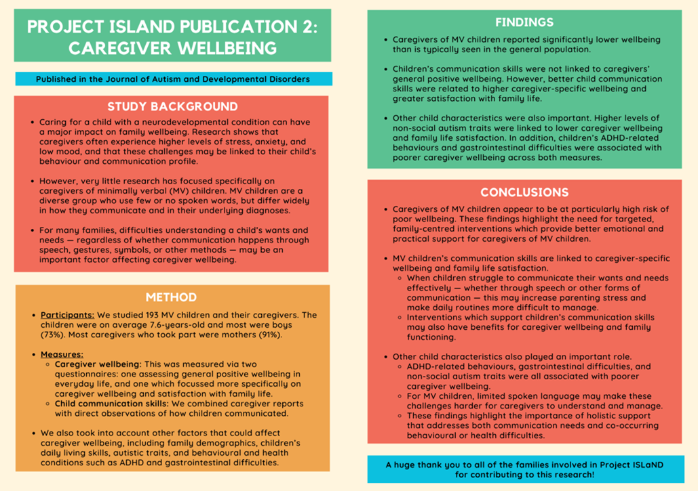

```{r setup, include=FALSE}
knitr::opts_chunk$set(echo = TRUE)
```


### Do Child Communicative Abilities Predict Subjective Wellbeing and Satisfaction With Family Life in Caregivers of Minimally Verbal Children?

Link to the full paper [here](https://link.springer.com/article/10.1007/s10803-026-07351-y)

#### Article summary:

{width=100%}
<br>

#### Video explanation:

{width=100%}


### Sub-groups of spoken language and broader communication skills in a large heterogenous cohort of minimally verbal school-age children: evidence of discrepant profiles

Link to the full paper [here](https://link.springer.com/article/10.1186/s13229-026-00701-8)

#### Article summary:

<a href="/images/Cluster paper lay summary PDF.pdf" target="_blank">Cluster paper summary</a>

#### Video explanation:

<a href="/videos/cluster.mp4" target="_blank">Cluster paper video</a>
