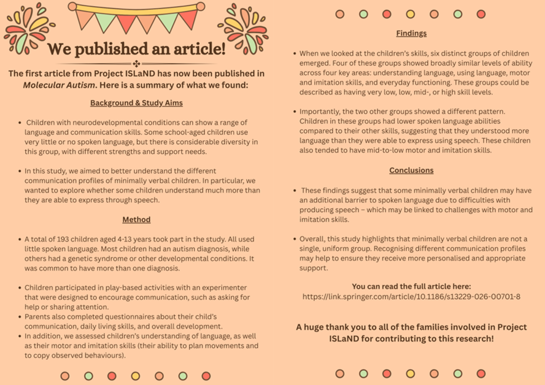

```{r setup, include=FALSE}
knitr::opts_chunk$set(echo = TRUE)
```


### Sub-groups of spoken language and broader communication skills in a large heterogenous cohort of minimally verbal school-age children: evidence of discrepant profiles

Link to the full paper [here](https://link.springer.com/article/10.1186/s13229-026-00701-8)

#### Article summary:

{width=100%}

#### Video explanation:

Watch this space...
<!-- {width=100%} -->