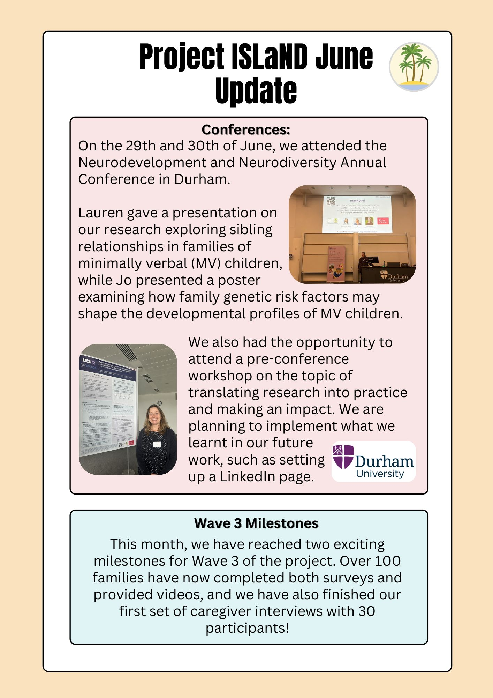

```{r setup, include=FALSE}
knitr::opts_chunk$set(echo = TRUE)
```

## Participant newsletters

<a href="/nletter/Aug25news.pdf" target="_blank">Newsletter August 2025.</a>

<a href="/nletter/Oct24news.pdf" target="_blank">Newsletter October 2024.</a>

## Updates

{width=100%} 

<a href="/updates/June Update.pdf" target="_blank">June 2026 Update</a>

<a href="/updates/April Update.pdf" target="_blank">April 2026 Update</a>

<a href="/updates/March Update.pdf" target="_blank">March 2026 Update</a>


