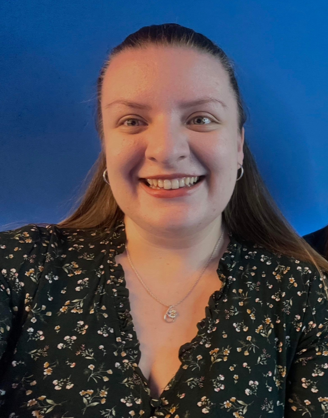
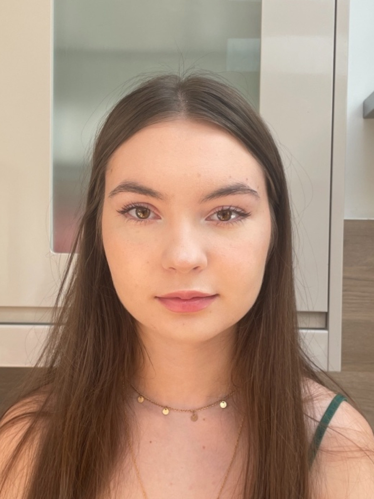
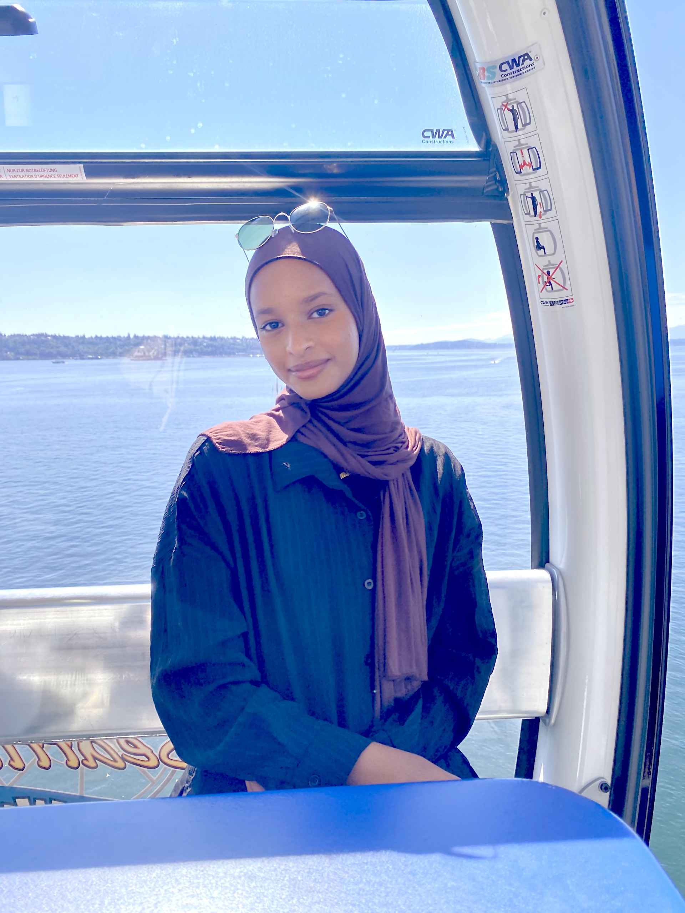
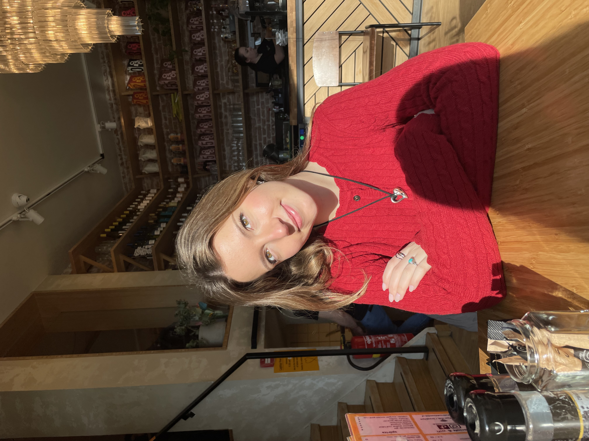
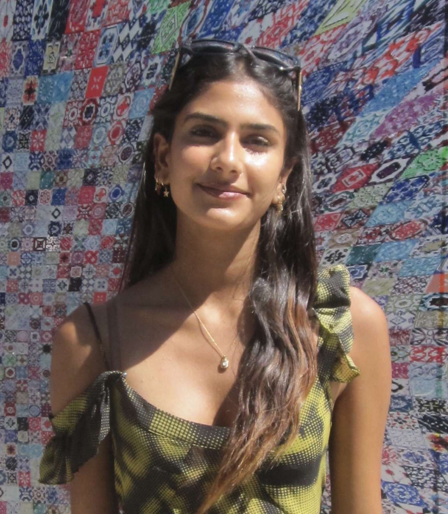
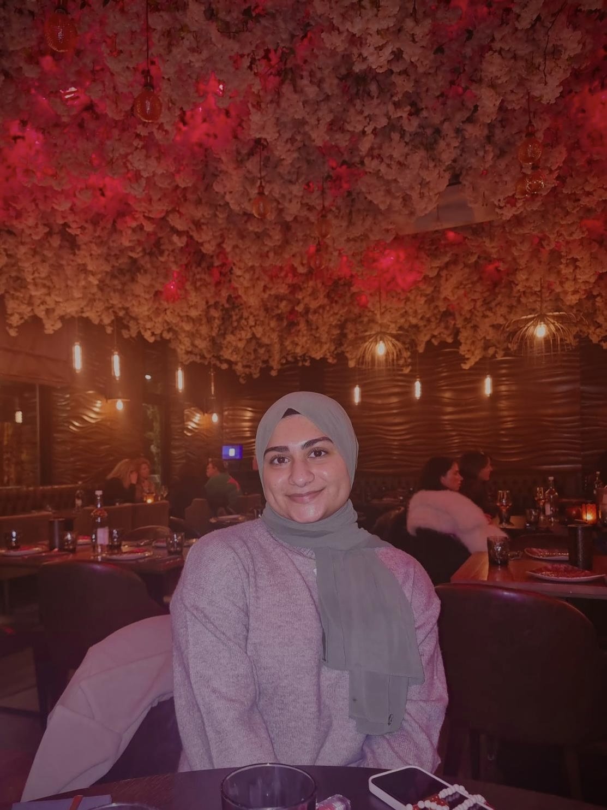
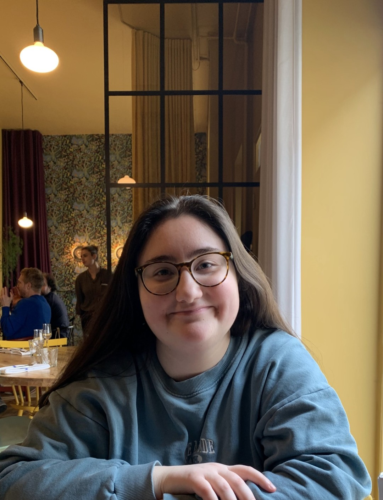

```{r setup, include=FALSE}
knitr::opts_chunk$set(echo = FALSE)
```

# Project ISLaND Team

## Dr Jo Saul

Dr Jo Saul is the leader of the ISLaND Lab and a Dorothy Hodgkin Research Fellow, funded by the Royal Society. 

She completed her ESRC-funded PhD at UCL in 2020, supervised by Professor Courtenay Norbury in UCL's Department of Language and Cognition. Jo's PhD explored expressive language development in minimally verbal autistic pre-schoolers. She conducted a longitudinal study investigating what predicts individual differences in expressive language development, in particular the role of speech production skills. She also created and piloted an app which delivered a speech sound intervention.

Jo is interested in individual differences in language development and how language impairment impacts mental health, learning and wellbeing. She is passionate about employing open science practices and robust statistical methods to maximise the quality of her research. As mum to a young person with additional needs, she feels strongly that research should reflect the voices of those with lived experience and thus employs participatory research methods and is keen to empower families to play an active role in research. She is also interested in intervention development and evaluation, particularly in how technology may be able to make interventions more accessible to help those with complex neurodevelopmental conditions. 

Jo has been a member of the [the Wellbeing and Language Lab](https://www.welllanglab.co.uk) since 2016. She was also a member of Autistica’s Language and Communication Study Group and is currently on the [Meeting on Language in Autism (MoLA) advisory board](https://molautism.org/about/advisory-board/).

{width=50%}

View Jo's CV [here](www/CV_web.pdf)

View her Google Scholar profile [here](https://scholar.google.com/citations?view_op=list_works&hl=en&user=lOhuIhkAAAAJ).

## Dr Lauren McGuinness

Dr Lauren McGuinness is a post-doctoral Research Fellow on the project.

She completed her ESRC-funded PhD in Psychology in 2025, supervised by Dr Kisten Abbot-Smith at the University of Kent. Lauren’s PhD examined the pragmatic language abilities and communicative preferences of autistic and non-autistic children. During her PhD, Lauren completed a three-month placement at McGill University in Canda, where she worked on a project examining the efficacy of a parent-mediated AAC intervention for minimally verbal children.

Lauren was also previously employed as a Social Researcher at the Office of the Children’s Commissioner, where she worked on projects for the Government’s Child Poverty Unit and the National Youth Strategy. This involved conducting qualitative fieldwork with vulnerable and disadvantaged children who had a range of additional needs. 

Lauren is passionate about using mixed-methods research to improve our understanding of autistic children’s diverse communication needs and to promote inclusive, participatory approaches that amplify the voices of under-represented groups.


{width=50%}

## Sama Soliman

Sama has been a part time research assistant in our lab since finishing her MSc placement with us earlier this year. 

{width=50%}

<br>

# Project ISLaND Students

## Undergraduate students

We are lucky to be joined by some amazing undergraduate students this year from the BSc in Psychology, BSc in Psychology and Language Sciences and iBSc courses. They are doing a great job of coding communicative acts in our video data and supporting our data collection efforts. 

### Katie

Katie's project is "Does education level moderate how parents adjust their utterance complexity when interacting with minimally verbal autistic children?"

{width=50%}
<br>
### Aaliyah

Aaliyah's project is "Evaluating the influence of depression on measures of child directed speech in parents of minimally verbal children with possible autism spectrum disorder."

{width=50%}
<br>
### Samaah

Samaah's project is "Parental Education and Utterance Type: Examining Differences in
Directive and Responsive Communication Styles."

{width=50%}
<br>
### Grace

Grace's project is "Exploring the Emotional and Practical Challenges of Raising a Minimally Verbal Child: A Mixed-Method Approach."

{width=50%}
<br>
### Kelly

Kelly's project is "Parental Broad Autism Phenotype and Verbal Responsiveness."

{width=50%}
<br>
### Mahak

Mahak's project is "How do caregivers experience and manage the challenges associated with feeding difficulties in minimally verbal children - a qualitative study."
{width=50%}


## Post-graduate students

We also have several masters students this year from the MSc in Psychological Sciences and Msc Speech and Language Therapy courses. They are taking part in our phonetic data coding and qualitative interview workstreams.

### Hannah

Hannah's project is "What factors best predict progress in speech sound production among minimally verbal children?"

{width=50%}

### Saamia

Saamia's project is "Predictors of Consonant Inventory in Minimally Verbal Children: The Role of Speech Imitation, Motivation, and Receptive Language."

{width=50%}

<!-- ### Harriet -->

<!-- ### Amy -->


# Project ISLaND Alumni

Lots of former colleagues, students and interns have helped us on our journey...

## Mollie Cooke

Mollie is a former research assistant on the project who is now a PhD candidate at the University of Surrey, where she is studying autism in genetic conditions.

She completed a MSc in Clinical Neurodevelopmental Sciences at Kings' College London and prior to that worked for several years in the voluntary sector providing information, support and advocacy to parents, carers and young people with additional needs. 

Mollie also has a loved one with complex support needs and she is passionate about including non-speaking and minimially verbal people in research. She is also a current member of the steering group.

{width=50%}

## Previous students

### Anna

{width=50%}

### Oliver

{width=50%}


### Natalie

{width=50%}

### Supipi

{width=50%}

<br>
### Bozhi

{width=50%}
<br>

# Join us!

We hope to grow the lab steadily over the next few years - head to [Get involved](https://josaul14.github.io/get-involved.html) to find out about potential opportunities to join us or collaborate.