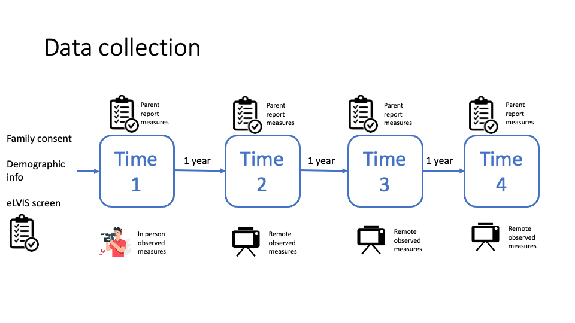

```{r setup, include=FALSE}
knitr::opts_chunk$set(echo = FALSE)
```


## What is Project ISLaND?

This project will investigate the prevalence and significance of speech-motor planning difficulties in neurodevelopmental conditions like autism, and how they relate to expressive language development. This will help us understand why some neurodivergent people have difficulty acquiring oral communication skills, and how best to support them.

This work is supported by a Dorothy Hodgkin Research Fellowship awarded to Dr Jo Saul in November 2022: link [here](https://royalsociety.org/news/2023/02/DHF-2022).

{width=25%}
<br>

## Project Overview

### Aim

To investigate why some neurodivergent children have difficulty acquiring spoken language, and how this might impact their social, cognitive, and emotional development.

### Method

* In 2023/24, just under 200 families with a minimally verbal child aged 4-12-years were recruited. Participants will be involved in four waves of data collection.

* Data will be gathered across a range of domains measuring:

* Children’s language abilities, including expressive and receptive vocabulary, motor and imitation skills, speech behaviors, preferred methods of communication, and therapeutic interventions.

* Other child-related factors, such as autistic traits, adaptive skills, sleep or feeding difficulties, sensory sensitivities, regression, and puberty.

* Wider family-related themes, including caregiver wellbeing, sibling relationships, and formal and informal carer support.  

* This data will be obtained from a combination of caregiver questionnaires and natural language samples of the child communicating with either a family member or researcher.

### Outcome

Gaining a better understanding of this topic will highlight how we can best support minimally verbal children and their families. 

{width=75%}


## Elucidating mechanisms of language growth in minimally verbal individuals

* The primary aim of Project ISLaND is to elucidate mechanisms of language growth in minimally verbal children.

* Our ethos is characterised by an inclusive transdiagnostic approach, mixed methods data collection, open science practices, and co-production with stakeholders.

* In this longitudinal study, we will track the developmental trajectories of a large cohort of minimally verbal children aged 4-12-years, primarily focussing on their language profiles and communication skills. 

* The findings will address theoretical questions about mechanisms underpinning individual differences in the spoken language abilities of this group, and add to the identification of early value-added predictors of language outcomes for minimally verbal individuals.

* Once all four waves of data collection are complete, additional information will be sought regarding the educational attainment and medical records of each participant. This will allow us to also evaluate links between observed communication growth and objective health and education milestones. 


